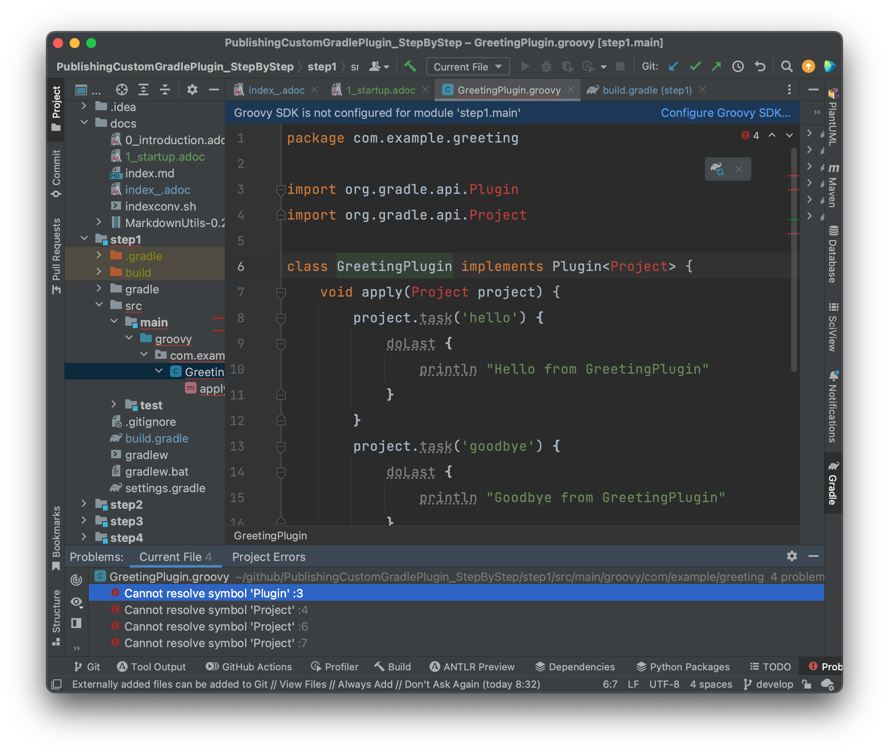

# Publishing Custom Gradle Plugin explained step by step

kazurayam,
26 March 2023

## Introduction

In this article I will explain how to publish custom Gradle plugins. I will present working sample codes. I will explain what sort of artifacts (files) are generated in the `<projectDir>/build` directory by the `java-gradle-plugin` and the `maven-publish` plugin.

I have made a public GitHub repository of this article and sample codes

-   <https://github.com/kazurayam/PublishingCustomGradlePlugin_StepByStep>

I used the gradle version 8.0.2, Java 17.0.7, macOS 12.6

### The official reference doc

At first you should have a look at the official Gradle documentation:

-   [Developing Custom Gradle Plugins](https://docs.gradle.org/current/userguide/custom_plugins.html)

The official docs include tons of detail information. I wandered around and had hard time to understand. In this article I would write what I found important but not clearly described in the official docs. In my humble opinion, the official docs tend to describe the front scene only, tend to hide what is going behind the scene of publishing Gradle plugins. Therefore I could not comprehend the description well. I looked at the publishing process step by step, studied what sort of artifacts are generated in the `<projectDir>/build` directory by the `java-gradle-plugin` and the `maven-publish` plugin. Finally I have got an "Aha!".

## §1 Start up

### What I’m doing here

In the step1, I will create a skeletal project where I will write a Groovy code as a custom Gradle plugin.

### settings.gradle and build.gradle

I made a directory named `step1` where I located `step1/settings.gradle` and `step1/build.gradle`.

#### step1/settings.gradle

    rootProject.name = 'step1'

#### step1/build.gradle

    plugins {
        id 'groovy'
    }

    group = 'com.example'
    version = '1.0'

    repositories {
        mavenCentral()
    }

    dependencies {
        // Use the awesome Spock testing and specification framework
        testImplementation 'org.spockframework:spock-core:2.3-groovy-3.0'
    }

    tasks.named('test') {
        // Use JUnit Jupiter for unit tests.
        useJUnitPlatform()
    }

### code of custom Gradle plugin

I wrote `step1/src/main/groovy/com/example/greeting/GreetingPlguin`.

    package com.example.greeting

    import org.gradle.api.Plugin
    import org.gradle.api.Project

    class GreetingPlugin implements Plugin<Project> {
        void apply(Project project) {
            project.task('hello') {
                doLast {
                    println "Hello from GreetingPlugin"
                }
            }
            project.task('goodbye') {
                doLast {
                    println "Goodbye from GreetingPlugin"
                }
            }
        }
    }

### code of JUnit5 test

`step1/src/test/groovy/com/example/greeting/GreetingPluginTest.groovy`

    package com.example.greeting

    import org.gradle.api.Project
    import org.gradle.testfixtures.ProjectBuilder
    import spock.lang.Specification

    class GreetingPluginTest extends Specification {
        def "the plugin registers the tasks"() {
            given:
            Project project = ProjectBuilder.builder().build()

            when:
            project.plugins.apply("org.sample.Greetings")

            then:
            project.tasks.findByName("hello") != null
            project.tasks.findByName("goodbye") != null

        }
    }

### How the build works

I tried to compile the Groovy code, but it doesn’t compile.

The Gradle API is not accessible for the compiler. Therefore, Groovy compiler failed to find the very core class `org.gradle.api.Project`.

### What needs to be done

In order to compile the code, I need to introduce the [java-gradle-plugin](https://docs.gradle.org/current/userguide/java_gradle_plugin.html) into the `build.gradle`. I will try it in the step2.

## §2 Introducing java-gradle-plugin

### What I’m doing here

Based on the step1, I will introduce the [java-gradle-plugin](https://docs.gradle.org/current/userguide/java_gradle_plugin.html) into the build.gradle file. With the plugin, the Gradle API becomes available to the `compileGroovy` task. The plugin also generates a "plugin descriptor", which will be includeded in the distributed jar file.

### settings.gradle and build.gradle

I made a directory named `step2` where I located `step2/settings.gradle` and `step2/build.gradle`.

#### step2/settings.gradle

    rootProject.name = 'step2'

#### step2/build.gradle

Refer to [step2/build.gradle](https://github.com/kazurayam/PublishingCustomGradlePlugin_StepByStep/blob/develop/step2/build.gradle)

Please note the 3rd line, we declare we use the java-gradle-plugin:

        id 'java-gradle-plugin'

And line#24, we declare the `plugin id` and the name of the implementation class:

    gradlePlugin {
        // Define the plugin
        plugins {
            MyGreeting {
                id = 'org.sample.Greetings'
                implementationClass = 'com.example.greeting.GreetingPlugin'
            }
        }
    }

You should note that the plugin id can be totally different from the class name. In order to demonstrate this point, I intentionally named the plugin id `org.sample.Greetings` and the fully qualified class name `com.example.greeting.GreeingPlugin`.

The following Gradle document describe how you can name the plugin id:

-   [creating a plugin id](https://docs.gradle.org/current/userguide/custom_plugins.html#sec:creating_a_plugin_id)

### How the build works

I could compile the Groovy code and run the junit test.

### Artifacts generated by java-gradle-plugin

In the `step2/build` directory, the java-gradle-plugin generated a lot of artifacts (files). Let’s look at them to see what the plugin did for us.

#### build directory

The `java-gradle-plugin` generated several artifacts in the `build` directory.

    $ tree ./build
    ./build
    ├── classes
    │   └── ...
    ├── generated
    │   └── ...
    ├── pluginDescriptors
    │   └── org.sample.Greetings.properties
    ├── pluginUnderTestMetadata
    │   └── ...
    ├── reports
    │   └── ...
    ├── resources
    │   └── main
    │       └── META-INF
    │           └── gradle-plugins
    │               └── org.sample.Greetings.properties
    ├── test-results
    │   └── ...
    └── tmp
        ├── ...

    47 directories, 20 files

Amongst them, the following files are interesting:

`step2/build/pluginDescriptors/org.sample.Greetings.properties`

    implementation-class=com.example.greeting.GreetingPlugin

`step2/build/resources/main/META-INF/gradle-plugins/org.sample.Greetings.properties`

    implementation-class=com.example.greeting.GreetingPlugin

In the Gradle documentation you can find a description what this properties file is.

-   [Behind the scene](https://docs.gradle.org/current/userguide/custom_plugins.html#behind_the_scenes)

### What needs to be done

Next, I want to publish the plugin. When I tried it, it failed of course.

    $ cd step2
    :~/github/PublishingCustomGradlePlugin_StepByStep/step2 (develop *)
    $ gradle publish

    FAILURE: Build failed with an exception.

    * What went wrong:
    Task 'publish' not found in root project 'step2'.
    ...

## §3 Introducing maven-publish plugin

### What I’m doing here

Based on the step2, I will introduce the [`maven-publish`](https://docs.gradle.org/current/userguide/publishing_maven.html) plugin. With it I will publish my custom Gradle plugin into a Maven repository located on the local disk. I will study what the `maven-publish` plugin does behind the scene.

### The official reference doc

At first you should have a look at the official Gradle documentation:

-   [Developing Custom Gradle Plugins](https://docs.gradle.org/current/userguide/custom_plugins.html)

### settings.gradle and build.gradle

I made a directory named `step3` where I located `step3/settings.gradle` and `step3/build.gradle`.

#### step3/settings.gradle

    rootProject.name = 'step3'

#### step3/build.gradle

Refer to [step3/build.gradle](https://github.com/kazurayam/PublishingCustomGradlePlugin_StepByStep/blob/develop/step3/build.gradle)

Note the line#5 declares the `mave-publish` plugin:

    plugins {
        ...
        id 'maven-publish'
    }

Also the line#35 we have `publishing` extention closure, where I declared a local Maven repository at the directory `step3/build/repos-maven`.

    publishing {
        repositories {
            maven {
                url = layout.buildDirectory.dir("repos-maven")
            }
        }
    }

### How the build works

    $ pwd
    /Users/kazuakiurayama/github/PublishingCustomGradlePlugin_StepByStep/step3
    :~/github/PublishingCustomGradlePlugin_StepByStep/step3 (develop *+)
    $ gradle clean

    BUILD SUCCESSFUL in 850ms
    1 actionable task: 1 executed
    :~/github/PublishingCustomGradlePlugin_StepByStep/step3 (develop *+)
    $ gradle  publish

    BUILD SUCCESSFUL in 881ms
    8 actionable tasks: 4 executed, 4 up-to-date

### Artifacts generated by the maven-publish plugin

#### The `build` directory tree

    :~/github/PublishingCustomGradlePlugin_StepByStep/step3 (develop *+)
    $ tree build
    build
    ├── classes
    │   └── ...
    ├── generated
    │   └── ...
    ├── libs
    │   └── step3-1.0.jar
    ├── pluginDescriptors
    │   └── org.sample.Greetings.properties
    ├── publications
    │   ├── MyGreetingPluginMarkerMaven
    │   │   └── pom-default.xml
    │   └── pluginMaven
    │       └── pom-default.xml
    ├── repos-maven
    │   ├── com
    │   │   └── example
    │   │       └── step3
    │   │           ├── 1.0
    │   │           │   ├── step3-1.0.jar
    │   │           │   ├── step3-1.0.jar.md5
    │   │           │   ├── step3-1.0.jar.sha1
    │   │           │   ├── step3-1.0.jar.sha256
    │   │           │   ├── step3-1.0.jar.sha512
    │   │           │   ├── step3-1.0.pom
    │   │           │   ├── step3-1.0.pom.md5
    │   │           │   ├── step3-1.0.pom.sha1
    │   │           │   ├── step3-1.0.pom.sha256
    │   │           │   └── step3-1.0.pom.sha512
    │   │           ├── maven-metadata.xml
    │   │           ├── maven-metadata.xml.md5
    │   │           ├── maven-metadata.xml.sha1
    │   │           ├── maven-metadata.xml.sha256
    │   │           └── maven-metadata.xml.sha512
    │   └── org
    │       └── sample
    │           └── Greetings
    │               └── org.sample.Greetings.gradle.plugin
    │                   ├── 1.0
    │                   │   ├── org.sample.Greetings.gradle.plugin-1.0.pom
    │                   │   ├── org.sample.Greetings.gradle.plugin-1.0.pom.md5
    │                   │   ├── org.sample.Greetings.gradle.plugin-1.0.pom.sha1
    │                   │   ├── org.sample.Greetings.gradle.plugin-1.0.pom.sha256
    │                   │   └── org.sample.Greetings.gradle.plugin-1.0.pom.sha512
    │                   ├── maven-metadata.xml
    │                   ├── maven-metadata.xml.md5
    │                   ├── maven-metadata.xml.sha1
    │                   ├── maven-metadata.xml.sha256
    │                   └── maven-metadata.xml.sha512
    ├── resources
    │   └── main
    │       └── META-INF
    │           └── gradle-plugins
    │               └── org.sample.Greetings.properties
    └── tmp
        ├── ...

    37 directories, 38 files

#### The jar file of the plugin’s binary

`step2/build/libs/step3-1.0.jar` was created. The jar includes the following content:

    :~/github/PublishingCustomGradlePlugin_StepByStep/step3 (develop *+)
    $ tar -xvf build/libs/step3-1.0.jar
    x META-INF/
    x META-INF/MANIFEST.MF
    x com/
    x com/example/
    x com/example/greeting/
    x com/example/greeting/GreetingPlugin$_apply_closure2$_closure4.class
    x com/example/greeting/GreetingPlugin$_apply_closure2.class
    x com/example/greeting/GreetingPlugin$_apply_closure1$_closure3.class
    x com/example/greeting/GreetingPlugin.class
    x com/example/greeting/GreetingPlugin$_apply_closure1.class
    x META-INF/gradle-plugins/
    x META-INF/gradle-plugins/org.sample.Greetings.properties

You can easily see, the jar contains the binary class files of my custom Gradle plugin `com.example.greeting.GreetingPlugin`, and the plugin descriptor which declares the plugin id \`org.sample.Greeting.

#### How the jar is named?

The name of the jar `step3-1.0.jar` was derived from the `rootProject.name=step3` in the [`step3/settings.gradle`](https://github.com/kazurayam/PublishingCustomGradlePlugin_StepByStep/blob/develop/step3/settings.gradle) file, plus the value of `project.version` property declared in the `step3/build.gradle`.

#### What contents are published in the Maven repository

In the `step3/build.gradle` I specified

    gradlePlugin {
        // Define the plugin
        plugins {
            MyGreeting {
                id = 'org.sample.Greetings'
                implementationClass = 'com.example.greeting.GreetingPlugin'
            }
        }
    }

    publishing {
        repositories {
            maven {
                url = layout.buildDirectory.dir("repos-maven")
            }
        }
    }

This resulted the following content in the local Maven repository:

    $ tree build
    build
    ├── publications
    │   ├── MyGreetingPluginMarkerMaven
    │   │   └── pom-default.xml
    │   └── pluginMaven
    │       └── pom-default.xml
    ├── repos-maven
    │   ├── com
    │   │   └── example
    │   │       └── step3
    │   │           ├── 1.0
    │   │           │   ├── step3-1.0.jar
    ...
    │   └── org
    │       └── sample
    │           └── Greetings
    │               └── org.sample.Greetings.gradle.plugin
    │                   ├── 1.0
    │                   │   ├── org.sample.Greetings.gradle.plugin-1.0.pom
    ...

the directory name `MyGreetingPluginMarkerMaven` is puzzling. It can be parsed into `MyGreeting` + 'PluginMarker' + 'Maven', which is "publication name" + 'PluginMarker' + "type of repository".

What is "PluginMarker"? --- You should read the official documantation of

-   linke:https://docs.gradle.org/current/userguide/plugins.html#sec:plugin\_markers\[Plugin Marker Artifacts\]

> Since the plugins {} DSL block only allows for declaring plugins by their globally unique plugin id and version properties, Gradle needs a way to look up the coordinates of the plugin implementation artifact. To do so, Gradle will look for a Plugin Marker Artifact with the coordinates plugin.id:plugin.id.gradle.plugin:plugin.version. This marker needs to have a dependency on the actual plugin implementation. Publishing these markers is automated by the java-gradle-plugin.

Well, this description is very difficult to understand. We need to look at some concrete example. Let’s start with `step3/build/publications/MyGreetingPluginMarkerMaven/pom-default.xml`

    <?xml version="1.0" encoding="UTF-8"?>
    <project xmlns="http://maven.apache.org/POM/4.0.0" xmlns:xsi="http://www.w3.org/2001/XMLSchema-instance" xsi:schemaLocation="http://maven.apache.org/POM/4.0.0 https://maven.apache.org/xsd/maven-4.0.0.xsd">
      <modelVersion>4.0.0</modelVersion>
      <groupId>org.sample.Greetings</groupId>
      <artifactId>org.sample.Greetings.gradle.plugin</artifactId>
      <version>1.0</version>
      <packaging>pom</packaging>
      <dependencies>
        <dependency>
          <groupId>com.example</groupId>
          <artifactId>step3</artifactId>
          <version>1.0</version>
        </dependency>
      </dependencies>
    </project>

Here you can see the plugin id `org.sample.Greetings` is encoded as `<groupId>org.sample.Greetings</groupId>`. And the `maven-publish` plugin generated `<artifactId>org.sample.Greetings.gradle.plugin</artifactId>`, which is followed by `<version>1.0</version>`. So this `pom-default.xml` file is declaring my custom Gradle plugin as an entity registered in the Maven repository.

And you can find that the `pom-default.xml` declares `<dependency>` to another entity in the maven repository, which can be addressed by the coordinate `com.example:step3:1.0`.

Now we need to look at `step3/build/publications/pluginMaven/pom-default.xml`

    <?xml version="1.0" encoding="UTF-8"?>
    <project xsi:schemaLocation="http://maven.apache.org/POM/4.0.0 https://maven.apache.org/xsd/maven-4.0.0.xsd" xmlns="http://maven.apache.org/POM/4.0.0"
        xmlns:xsi="http://www.w3.org/2001/XMLSchema-instance">
      <modelVersion>4.0.0</modelVersion>
      <groupId>com.example</groupId>
      <artifactId>step3</artifactId>
      <version>1.0</version>
    </project>

This corresponds to the entry in the Maven repository with the coordinate `group: "com.example", name: "step3" version: "1.0"`, which contains the binary jar file.

    $ tree build
    build
    ...
    ├── repos-maven
    │   ├── com
    │   │   └── example
    │   │       └── step3
    │   │           ├── 1.0
    │   │           │   ├── step3-1.0.jar
    ...

In short, `maven-publish` plugin publishes 2 entities for a custom Gradle plugin in Maven repository. One is the plugin’s POM xml file. Another is the jar file of plugin’s implementation jar file.

Any gradle build that uses my `org.sample.Greetings` plugin, will first get access to the plugin’s POM xml with the coordinate `group: "com.example", name: "step3", version: "1.0"`. The user build will parse the POM xml and will find further dependencies are required. So the user build will get access to the plugin’s implementation jar, which is identified as `group: "com.example", name: "step3", version: "1.0"`.

I initially thought that I am going to publish a Gradle plugin into a repository. The processing behind the scene is not as simple as I thought. There are 2 entities published in the maven repository, which are closely related. The `maven-publish` plugin manages this compilicated processing silently.

## §4 Maven and Ivy

### What I’m doing here

Gradle supports published the artifacts into 2 types of repositories: Maven and Ivy. In the previous step3, I published my custom plugin into a local Maven repository. In this step4, I will publish ti into a local Ivy repository as well.

### settings.gradle and build.gradle

I made a directory named `step4` where I located `step4/settings.gradle` and `step4/build.gradle`.

#### step4/settings.gradle

    rootProject.name = 'step4'

#### step4/build.gradle

Refer to [step4/build.gradle](https://github.com/kazurayam/PublishingCustomGradlePlugin_StepByStep/blob/develop/step4/build.gradle)

Note the line#6 declares `ivy-publish` plugin:

    plugins {
        ...
        id 'maven-publish'
        id 'ivy-publish'
    }

Also the line#36 we have `publishing` extension closure, where I declared a local Ivy repository at the directory `build/repos-ivy` as well as a Maven repository.

        repositories {
            maven {
                url = layout.buildDirectory.dir("repos-maven")
            }
        }
    }

    // https://docs.gradle.org/current/userguide/publishing_gradle_module_metadata.html#sub:disabling-gmm-publication
    tasks.withType(GenerateModuleMetadata) {
        enabled = false

### How the build works

    $ pwd
    /Users/kazuakiurayama/github/PublishingCustomGradlePlugin_StepByStep/step4
    :~/github/PublishingCustomGradlePlugin_StepByStep/step4 (develop *+)
    $ gradle clean

    BUILD SUCCESSFUL in 850ms
    1 actionable task: 1 executed
    :~/github/PublishingCustomGradlePlugin_StepByStep/step4 (develop *+)
    $ gradle  publish

    BUILD SUCCESSFUL in 881ms
    8 actionable tasks: 4 executed, 4 up-to-date

### Artifacts generated by the maven-publish plugin

#### The `build` directory tree

When I run `gradle publsh`, the build generated a lot of files under the `build` directory.

    :~/github/PublishingCustomGradlePlugin_StepByStep/step4 (develop *)
    $ tree build
    build
    ├── classes
    │   └── ...
    ├── generated
    │   └── ...
    ├── libs
    │   └── step4-1.0.jar
    ├── pluginDescriptors
    │   └── org.sample.Greetings.properties
    ├── pluginUnderTestMetadata
    │   └── plugin-under-test-metadata.properties
    ├── publications
    │   ├── MyGreetingPluginMarkerIvy
    │   │   └── ivy.xml
    │   ├── MyGreetingPluginMarkerMaven
    │   │   ├── org.sample.Greetings.gradle.plugin (1).iml
    │   │   └── pom-default.xml
    │   ├── pluginIvy
    │   │   └── ivy.xml
    │   └── pluginMaven
    │       ├── pom-default.xml
    │       └── step4.iml
    ├── reports
    │   └── ...
    ├── repos-ivy
    │   ├── com.example
    │   │   └── step4
    │   │       └── 1.0
    │   │           ├── ivy-1.0.xml
    │   │           ├── ivy-1.0.xml.sha1
    │   │           ├── ivy-1.0.xml.sha256
    │   │           ├── ivy-1.0.xml.sha512
    │   │           ├── step4-1.0.jar
    │   │           ├── step4-1.0.jar.sha1
    │   │           ├── step4-1.0.jar.sha256
    │   │           └── step4-1.0.jar.sha512
    │   └── org.sample.Greetings
    │       └── org.sample.Greetings.gradle.plugin
    │           └── 1.0
    │               ├── ivy-1.0.xml
    │               ├── ivy-1.0.xml.sha1
    │               ├── ivy-1.0.xml.sha256
    │               └── ivy-1.0.xml.sha512
    ├── repos-maven
    │   ├── com
    │   │   └── example
    │   │       └── step4
    │   │           ├── 1.0
    │   │           │   ├── step4-1.0.jar
    │   │           │   ├── step4-1.0.jar.md5
    │   │           │   ├── step4-1.0.jar.sha1
    │   │           │   ├── step4-1.0.jar.sha256
    │   │           │   ├── step4-1.0.jar.sha512
    │   │           │   ├── step4-1.0.pom
    │   │           │   ├── step4-1.0.pom.md5
    │   │           │   ├── step4-1.0.pom.sha1
    │   │           │   ├── step4-1.0.pom.sha256
    │   │           │   └── step4-1.0.pom.sha512
    │   │           ├── maven-metadata.xml
    │   │           ├── maven-metadata.xml.md5
    │   │           ├── maven-metadata.xml.sha1
    │   │           ├── maven-metadata.xml.sha256
    │   │           └── maven-metadata.xml.sha512
    │   └── org
    │       └── sample
    │           └── Greetings
    │               └── org.sample.Greetings.gradle.plugin
    │                   ├── 1.0
    │                   │   ├── org.sample.Greetings.gradle.plugin-1.0.pom
    │                   │   ├── org.sample.Greetings.gradle.plugin-1.0.pom.md5
    │                   │   ├── org.sample.Greetings.gradle.plugin-1.0.pom.sha1
    │                   │   ├── org.sample.Greetings.gradle.plugin-1.0.pom.sha256
    │                   │   └── org.sample.Greetings.gradle.plugin-1.0.pom.sha512
    │                   ├── maven-metadata.xml
    │                   ├── maven-metadata.xml.md5
    │                   ├── maven-metadata.xml.sha1
    │                   ├── maven-metadata.xml.sha256
    │                   └── maven-metadata.xml.sha512
    ├── resources
    │   └── main
    │       └── META-INF
    │           └── gradle-plugins
    │               └── org.sample.Greetings.properties
    ├── test-results
    │   └── ...
    ...
    80 directories, 68 files

I looked at the following directories and found it interesting:

-   step4/build/publications/MyGreetingPluginMarker**Ivy**

-   step4/build/publications/MyGreetingPluginMarker**Maven**

-   step4/build/publications/plugin**Ivy**

-   step4/build/publications/plugin**Maven**

I found a sort of symmetry here. If Gradle add a new type of reposotry named "Bar", then a new plugin `bar-publish` will be developed, and we will find the following publications added:

-   step4/build/publications/MyGreetingPluginMarker**Bar**

-   step4/build/publications/plugin**Bar**

step5 : want to publish multiple custom plugins out of a single project

step6 : want to specify the custom name of jar file.

step7 : want to publish the sources.jar and the javadoc.jar.
