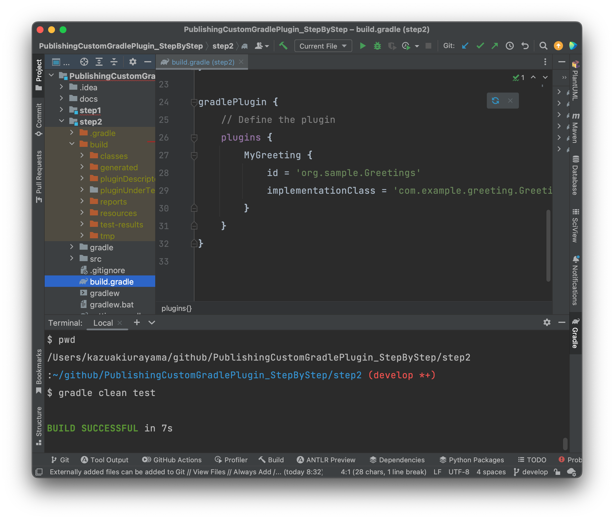

-   <a href="#publishing-custom-gradle-plugin-explained-step-by-step" id="toc-publishing-custom-gradle-plugin-explained-step-by-step">Publishing Custom Gradle Plugin explained step by step</a>
    -   <a href="#introduction" id="toc-introduction">Introduction</a>
        -   <a href="#overview" id="toc-overview">Overview</a>
    -   <a href="#1-start-up" id="toc-1-start-up">§1 Start up</a>
        -   <a href="#what-im-doing-here" id="toc-what-im-doing-here">What I’m doing here</a>
        -   <a href="#settings-gradle-and-build-gradle" id="toc-settings-gradle-and-build-gradle">settings.gradle and build.gradle</a>
            -   <a href="#step1settings-gradle" id="toc-step1settings-gradle">step1/settings.gradle</a>
            -   <a href="#step1build-gradle" id="toc-step1build-gradle">step1/build.gradle</a>
        -   <a href="#code-of-custom-gradle-plugin" id="toc-code-of-custom-gradle-plugin">code of custom Gradle plugin</a>
        -   <a href="#code-of-junit5-test" id="toc-code-of-junit5-test">code of JUnit5 test</a>
        -   <a href="#how-the-build-works" id="toc-how-the-build-works">How the build works</a>
        -   <a href="#what-needs-to-be-done" id="toc-what-needs-to-be-done">What needs to be done</a>
    -   <a href="#2-introducing-java-gradle-plugin" id="toc-2-introducing-java-gradle-plugin">§2 Introducing java-gradle-plugin</a>
        -   <a href="#what-im-doing-here-2" id="toc-what-im-doing-here-2">What I’m doing here</a>
        -   <a href="#settings-gradle-and-build-gradle-2" id="toc-settings-gradle-and-build-gradle-2">settings.gradle and build.gradle</a>
            -   <a href="#step2settings-gradle" id="toc-step2settings-gradle">step2/settings.gradle</a>
            -   <a href="#step2build-gradle" id="toc-step2build-gradle">step2/build.gradle</a>
        -   <a href="#how-the-build-works-2" id="toc-how-the-build-works-2">How the build works</a>
        -   <a href="#artifacts-generated-by-java-gradle-plugin" id="toc-artifacts-generated-by-java-gradle-plugin">Artifacts generated by java-gradle-plugin</a>
            -   <a href="#build-directory" id="toc-build-directory">build directory</a>
        -   <a href="#what-needs-to-be-done-2" id="toc-what-needs-to-be-done-2">What needs to be done</a>
    -   <a href="#3-introducing-maven-publish-plugin" id="toc-3-introducing-maven-publish-plugin">§3 Introducing maven-publish plugin</a>
        -   <a href="#what-im-doing-here-3" id="toc-what-im-doing-here-3">What I’m doing here</a>
        -   <a href="#the-official-reference-doc" id="toc-the-official-reference-doc">The official reference doc</a>
        -   <a href="#settings-gradle-and-build-gradle-3" id="toc-settings-gradle-and-build-gradle-3">settings.gradle and build.gradle</a>
            -   <a href="#step3settings-gradle" id="toc-step3settings-gradle">step3/settings.gradle</a>
            -   <a href="#step3build-gradle" id="toc-step3build-gradle">step3/build.gradle</a>
        -   <a href="#how-the-build-works-3" id="toc-how-the-build-works-3">How the build works</a>
        -   <a href="#artifacts-generated-by-the-maven-publish-plugin" id="toc-artifacts-generated-by-the-maven-publish-plugin">Artifacts generated by the maven-publish plugin</a>
            -   <a href="#the-build-directory-tree" id="toc-the-build-directory-tree">The <code>build</code> directory tree</a>
            -   <a href="#the-jar-file-of-the-plugins-binary" id="toc-the-jar-file-of-the-plugins-binary">The jar file of the plugin’s binary</a>
            -   <a href="#how-the-jar-is-named" id="toc-how-the-jar-is-named">How the jar is named?</a>
            -   <a href="#what-contents-are-published-in-the-maven-repository" id="toc-what-contents-are-published-in-the-maven-repository">What contents are published in the Maven repository</a>
        -   <a href="#publish-xxx-tasks" id="toc-publish-xxx-tasks">"publish XXX" tasks</a>
            -   <a href="#publications" id="toc-publications">Publications</a>
            -   <a href="#repositories-mavenlocal-sketch" id="toc-repositories-mavenlocal-sketch">Repositories "MavenLocal", "Sketch"</a>
    -   <a href="#4-maven-and-ivy" id="toc-4-maven-and-ivy">§4 Maven and Ivy</a>
        -   <a href="#what-im-doing-here-4" id="toc-what-im-doing-here-4">What I’m doing here</a>
        -   <a href="#settings-gradle-and-build-gradle-4" id="toc-settings-gradle-and-build-gradle-4">settings.gradle and build.gradle</a>
            -   <a href="#step4settings-gradle" id="toc-step4settings-gradle">step4/settings.gradle</a>
            -   <a href="#step4build-gradle" id="toc-step4build-gradle">step4/build.gradle</a>
        -   <a href="#how-the-build-works-4" id="toc-how-the-build-works-4">How the build works</a>
        -   <a href="#artifacts-generated-by-the-maven-publish-plugin-2" id="toc-artifacts-generated-by-the-maven-publish-plugin-2">Artifacts generated by the maven-publish plugin</a>
            -   <a href="#the-build-directory-tree-2" id="toc-the-build-directory-tree-2">The <code>build</code> directory tree</a>
    -   <a href="#5-publishing-multiple-plugins-out-of-a-single-project" id="toc-5-publishing-multiple-plugins-out-of-a-single-project">§5 Publishing Multiple Plugins out of a single project</a>
        -   <a href="#what-im-doing-here-5" id="toc-what-im-doing-here-5">What I’m doing here</a>
        -   <a href="#groovy-sources-of-the-plugins" id="toc-groovy-sources-of-the-plugins">Groovy sources of the plugins</a>
        -   <a href="#settings-gradle-and-build-gradle-5" id="toc-settings-gradle-and-build-gradle-5">settings.gradle and build.gradle</a>
            -   <a href="#step5settings-gradle" id="toc-step5settings-gradle">step5/settings.gradle</a>
            -   <a href="#step5build-gradle" id="toc-step5build-gradle">step5/build.gradle</a>
        -   <a href="#how-the-build-works-5" id="toc-how-the-build-works-5">How the build works</a>
        -   <a href="#artifacts-generated-by-the-maven-publish-plugin-3" id="toc-artifacts-generated-by-the-maven-publish-plugin-3">Artifacts generated by the maven-publish plugin</a>
    -   <a href="#6-publishing-the-binary-jar-with-custom-name" id="toc-6-publishing-the-binary-jar-with-custom-name">§6 Publishing the binary jar with custom name</a>
        -   <a href="#what-im-going-to-do-here" id="toc-what-im-going-to-do-here">What I’m going to do here</a>
    -   <a href="#7-publishing-the-sources-jar-and-the-javadoc-jar" id="toc-7-publishing-the-sources-jar-and-the-javadoc-jar">§7 publishing the sources.jar and the javadoc.jar</a>
        -   <a href="#what-im-going-to-do-here-2" id="toc-what-im-going-to-do-here-2">What I’m going to do here</a>
    -   <a href="#8-publishing-into-maven-repository-on-github-packages" id="toc-8-publishing-into-maven-repository-on-github-packages">§8 Publishing into Maven repository on GitHub Packages</a>
        -   <a href="#what-im-going-to-do-here-3" id="toc-what-im-going-to-do-here-3">What I’m going to do here</a>
    -   <a href="#9-publishing-a-custom-plugin-to-the-gradle-plugin-portal" id="toc-9-publishing-a-custom-plugin-to-the-gradle-plugin-portal">§9 Publishing a custom plugin to the Gradle Plugin Portal</a>
        -   <a href="#what-is-com-gradle-plugin-publish-plugin" id="toc-what-is-com-gradle-plugin-publish-plugin">What is <code>com.gradle.plugin-publish</code> plugin?</a>
        -   <a href="#publish-xxx-commands" id="toc-publish-xxx-commands">"publish XXX" commands</a>
        -   <a href="#finally-publish-it-to-gradle-plugin-portal" id="toc-finally-publish-it-to-gradle-plugin-portal">Finally, publish it to Gradle Plugin Portal</a>

# Publishing Custom Gradle Plugin explained step by step

kazurayam,
26 March 2023

## Introduction

I have made a public GitHub repository of this article and sample codes

-   <https://github.com/kazurayam/PublishingCustomGradlePlugin_StepByStep>

I used the gradle version 8.0.2, Java 17.0.7, macOS 12.6

### Overview

In this article I will explain the process of publising custom Gradle plugins. I will present a set of working sample codes.

I started with the official Gradle documentation:

-   [Developing Custom Gradle Plugins](https://docs.gradle.org/current/userguide/custom_plugins.html)

The official docs include tons of detail information. I wandered around and had a hard time to understand. In my humble opinion, the official docs tend to describe the front scene only, tend to hide *what is going on behind the scene of publishing Gradle plugins*. I studied the publishing process step by step, studied what sort of artifacts are generated in the `<projectDir>/build` directory by the `java-gradle-plugin`, the `maven-publish` plugin and the `com.gradle.plugin-publish` plugin. Finally I have got an "Aha!".

## §1 Start up

### What I’m doing here

In the step1, I will create a skeletal project where I will write a Groovy code as a custom Gradle plugin.

### settings.gradle and build.gradle

I made a directory named `step1` where I located `step1/settings.gradle` and `step1/build.gradle`.

#### step1/settings.gradle

    rootProject.name = 'step1'

#### step1/build.gradle

    plugins {
        id 'groovy'
    }

    group = 'com.example'
    version = '1.0'

    repositories {
        mavenCentral()
    }

    dependencies {
        // Use the awesome Spock testing and specification framework
        testImplementation 'org.spockframework:spock-core:2.3-groovy-3.0'
    }

    tasks.named('test') {
        // Use JUnit Jupiter for unit tests.
        useJUnitPlatform()
    }

### code of custom Gradle plugin

I wrote `step1/src/main/groovy/com/example/greeting/GreetingPlguin`.

    package com.example.greeting

    import org.gradle.api.Plugin
    import org.gradle.api.Project

    class GreetingPlugin implements Plugin<Project> {
        void apply(Project project) {
            project.task('hello') {
                doLast {
                    println "Hello from GreetingPlugin"
                }
            }
            project.task('goodbye') {
                doLast {
                    println "Goodbye from GreetingPlugin"
                }
            }
        }
    }

### code of JUnit5 test

`step1/src/test/groovy/com/example/greeting/GreetingPluginTest.groovy`

    package com.example.greeting

    import org.gradle.api.Project
    import org.gradle.testfixtures.ProjectBuilder
    import spock.lang.Specification

    class GreetingPluginTest extends Specification {
        def "the plugin registers the tasks"() {
            given:
            Project project = ProjectBuilder.builder().build()

            when:
            project.plugins.apply("org.sample.Greetings")

            then:
            project.tasks.findByName("hello") != null
            project.tasks.findByName("goodbye") != null

        }
    }

### How the build works

I tried to compile the Groovy code, but it doesn’t compile.

The Gradle API is not accessible for the compiler. Therefore, Groovy compiler failed to find the very core class `org.gradle.api.Project`.

### What needs to be done

In order to compile the code, I need to introduce the [java-gradle-plugin](https://docs.gradle.org/current/userguide/java_gradle_plugin.html) into the `build.gradle`. I will try it in the step2.

## §2 Introducing java-gradle-plugin

### What I’m doing here

Based on the step1, I will introduce the [java-gradle-plugin](https://docs.gradle.org/current/userguide/java_gradle_plugin.html) into the build.gradle file. With the plugin, the Gradle API becomes available to the `compileGroovy` task. The plugin also generates a "plugin descriptor", which will be includeded in the distributed jar file.

### settings.gradle and build.gradle

I made a directory named `step2` where I located `step2/settings.gradle` and `step2/build.gradle`.

#### step2/settings.gradle

    rootProject.name = 'step2'

#### step2/build.gradle

Refer to [step2/build.gradle](https://github.com/kazurayam/PublishingCustomGradlePlugin_StepByStep/blob/develop/step2/build.gradle)

Please note the 3rd line, we declare we use the java-gradle-plugin:

        id 'java-gradle-plugin'

And line#24, we declare the `plugin id` and the name of the implementation class:

        // Define the plugin
        plugins {
            MyGreeting {
                id = 'org.sample.Greetings'
                implementationClass = 'com.example.greeting.GreetingPlugin'
            }
        }
    }

You should note that the plugin id can be totally different from the class name. In order to demonstrate this point, I intentionally named the plugin id `org.sample.Greetings` and the fully qualified class name `com.example.greeting.GreeingPlugin`.

The following Gradle document describe how you can name the plugin id:

-   [creating a plugin id](https://docs.gradle.org/current/userguide/custom_plugins.html#sec:creating_a_plugin_id)

### How the build works

I could compile the Groovy code and run the junit test.

### Artifacts generated by java-gradle-plugin

In the `step2/build` directory, the java-gradle-plugin generated a lot of artifacts (files). Let’s look at them to see what the plugin did for us.

#### build directory

The `java-gradle-plugin` generated several artifacts in the `build` directory.

    $ tree ./build
    ./build
    ├── classes
    │   └── ...
    ├── generated
    │   └── ...
    ├── pluginDescriptors
    │   └── org.sample.Greetings.properties
    ├── pluginUnderTestMetadata
    │   └── ...
    ├── reports
    │   └── ...
    ├── resources
    │   └── main
    │       └── META-INF
    │           └── gradle-plugins
    │               └── org.sample.Greetings.properties
    ├── test-results
    │   └── ...
    └── tmp
        ├── ...

    47 directories, 20 files

Amongst them, the following files are interesting:

`step2/build/pluginDescriptors/org.sample.Greetings.properties`

    implementation-class=com.example.greeting.GreetingPlugin

`step2/build/resources/main/META-INF/gradle-plugins/org.sample.Greetings.properties`

    implementation-class=com.example.greeting.GreetingPlugin

In the Gradle documentation you can find a description what this properties file is.

-   [Behind the scene](https://docs.gradle.org/current/userguide/custom_plugins.html#behind_the_scenes)

### What needs to be done

Next, I want to publish the plugin. When I tried it, it failed of course.

    $ cd step2
    :~/github/PublishingCustomGradlePlugin_StepByStep/step2 (develop *)
    $ gradle publish

    FAILURE: Build failed with an exception.

    * What went wrong:
    Task 'publish' not found in root project 'step2'.
    ...

## §3 Introducing maven-publish plugin

### What I’m doing here

Based on the step2, I will introduce the [`maven-publish`](https://docs.gradle.org/current/userguide/publishing_maven.html) plugin. With it I will publish my custom Gradle plugin into a Maven repository located on the local disk. I will study what the `maven-publish` plugin does behind the scene.

### The official reference doc

At first you should have a look at the official Gradle documentation:

-   [Developing Custom Gradle Plugins](https://docs.gradle.org/current/userguide/custom_plugins.html)

### settings.gradle and build.gradle

I made a directory named `step3` where I located `step3/settings.gradle` and `step3/build.gradle`.

#### step3/settings.gradle

    rootProject.name = 'step3'

#### step3/build.gradle

Refer to [step3/build.gradle](https://github.com/kazurayam/PublishingCustomGradlePlugin_StepByStep/blob/develop/step3/build.gradle)

Note the line#5 declares the `mave-publish` plugin:

    plugins {
        ...
        id 'maven-publish'
    }

Also the line#35 we have `publishing` extention closure, where I declared a local Maven repository at the directory `step3/build/repos-maven`.

        repositories {
            maven {
                name = "sketch"
                url = layout.buildDirectory.dir("repos-maven")
            }
        }
    }

### How the build works

    $ pwd
    /Users/kazuakiurayama/github/PublishingCustomGradlePlugin_StepByStep/step3
    :~/github/PublishingCustomGradlePlugin_StepByStep/step3 (develop *+)
    $ gradle clean

    BUILD SUCCESSFUL in 850ms
    1 actionable task: 1 executed
    :~/github/PublishingCustomGradlePlugin_StepByStep/step3 (develop *+)
    $ gradle  publish

    BUILD SUCCESSFUL in 881ms
    8 actionable tasks: 4 executed, 4 up-to-date

### Artifacts generated by the maven-publish plugin

#### The `build` directory tree

    :~/github/PublishingCustomGradlePlugin_StepByStep/step3 (develop *+)
    $ tree build
    build
    ├── classes
    │   └── ...
    ├── generated
    │   └── ...
    ├── libs
    │   └── step3-1.0.jar
    ├── pluginDescriptors
    │   └── org.sample.Greetings.properties
    ├── publications
    │   ├── MyGreetingPluginMarkerMaven
    │   │   └── pom-default.xml
    │   └── pluginMaven
    │       └── pom-default.xml
    ├── repos-maven
    │   ├── com
    │   │   └── example
    │   │       └── step3
    │   │           ├── 1.0
    │   │           │   ├── step3-1.0.jar
    │   │           │   ├── step3-1.0.jar.md5
    │   │           │   ├── step3-1.0.jar.sha1
    │   │           │   ├── step3-1.0.jar.sha256
    │   │           │   ├── step3-1.0.jar.sha512
    │   │           │   ├── step3-1.0.pom
    │   │           │   ├── step3-1.0.pom.md5
    │   │           │   ├── step3-1.0.pom.sha1
    │   │           │   ├── step3-1.0.pom.sha256
    │   │           │   └── step3-1.0.pom.sha512
    │   │           ├── maven-metadata.xml
    │   │           ├── maven-metadata.xml.md5
    │   │           ├── maven-metadata.xml.sha1
    │   │           ├── maven-metadata.xml.sha256
    │   │           └── maven-metadata.xml.sha512
    │   └── org
    │       └── sample
    │           └── Greetings
    │               └── org.sample.Greetings.gradle.plugin
    │                   ├── 1.0
    │                   │   ├── org.sample.Greetings.gradle.plugin-1.0.pom
    │                   │   ├── org.sample.Greetings.gradle.plugin-1.0.pom.md5
    │                   │   ├── org.sample.Greetings.gradle.plugin-1.0.pom.sha1
    │                   │   ├── org.sample.Greetings.gradle.plugin-1.0.pom.sha256
    │                   │   └── org.sample.Greetings.gradle.plugin-1.0.pom.sha512
    │                   ├── maven-metadata.xml
    │                   ├── maven-metadata.xml.md5
    │                   ├── maven-metadata.xml.sha1
    │                   ├── maven-metadata.xml.sha256
    │                   └── maven-metadata.xml.sha512
    ├── resources
    │   └── main
    │       └── META-INF
    │           └── gradle-plugins
    │               └── org.sample.Greetings.properties
    └── tmp
        ├── ...

    37 directories, 38 files

#### The jar file of the plugin’s binary

`step2/build/libs/step3-1.0.jar` was created. The jar includes the following content:

    :~/github/PublishingCustomGradlePlugin_StepByStep/step3 (develop *+)
    $ tar -xvf build/libs/step3-1.0.jar
    x META-INF/
    x META-INF/MANIFEST.MF
    x com/
    x com/example/
    x com/example/greeting/
    x com/example/greeting/GreetingPlugin$_apply_closure2$_closure4.class
    x com/example/greeting/GreetingPlugin$_apply_closure2.class
    x com/example/greeting/GreetingPlugin$_apply_closure1$_closure3.class
    x com/example/greeting/GreetingPlugin.class
    x com/example/greeting/GreetingPlugin$_apply_closure1.class
    x META-INF/gradle-plugins/
    x META-INF/gradle-plugins/org.sample.Greetings.properties

You can easily see, the jar contains the binary class files of my custom Gradle plugin `com.example.greeting.GreetingPlugin`, and the plugin descriptor which declares the plugin id \`org.sample.Greeting.

#### How the jar is named?

The name of the jar `step3-1.0.jar` was derived from the `rootProject.name=step3` in the [`step3/settings.gradle`](https://github.com/kazurayam/PublishingCustomGradlePlugin_StepByStep/blob/develop/step3/settings.gradle) file, plus the value of `project.version` property declared in the `step3/build.gradle`.

#### What contents are published in the Maven repository

In the `step3/build.gradle` I specified

    gradlePlugin {
        // Define the plugin
        plugins {
            MyGreeting {
                id = 'org.sample.Greetings'
                implementationClass = 'com.example.greeting.GreetingPlugin'
            }
        }
    }

    publishing {
        repositories {
            maven {
                url = layout.buildDirectory.dir("repos-maven")
            }
        }
    }

This resulted the following content in the local Maven repository:

    $ tree build
    build
    ├── publications
    │   ├── MyGreetingPluginMarkerMaven
    │   │   └── pom-default.xml
    │   └── pluginMaven
    │       └── pom-default.xml
    ├── repos-maven
    │   ├── com
    │   │   └── example
    │   │       └── step3
    │   │           ├── 1.0
    │   │           │   ├── step3-1.0.jar
    ...
    │   └── org
    │       └── sample
    │           └── Greetings
    │               └── org.sample.Greetings.gradle.plugin
    │                   ├── 1.0
    │                   │   ├── org.sample.Greetings.gradle.plugin-1.0.pom
    ...

the directory name `MyGreetingPluginMarkerMaven` is puzzling. It can be parsed into `MyGreeting` + 'PluginMarker' + 'Maven', which is "publication name" + 'PluginMarker' + "type of repository".

What is "PluginMarker"? --- You should read the official documantation of

-   linke:https://docs.gradle.org/current/userguide/plugins.html#sec:plugin\_markers\[Plugin Marker Artifacts\]

> Since the plugins {} DSL block only allows for declaring plugins by their globally unique plugin id and version properties, Gradle needs a way to look up the coordinates of the plugin implementation artifact. To do so, Gradle will look for a Plugin Marker Artifact with the coordinates plugin.id:plugin.id.gradle.plugin:plugin.version. This marker needs to have a dependency on the actual plugin implementation. Publishing these markers is automated by the java-gradle-plugin.

Well, this description is very difficult to understand. We need to look at some concrete example. Let’s start with `step3/build/publications/MyGreetingPluginMarkerMaven/pom-default.xml`

    <?xml version="1.0" encoding="UTF-8"?>
    <project xmlns="http://maven.apache.org/POM/4.0.0" xmlns:xsi="http://www.w3.org/2001/XMLSchema-instance" xsi:schemaLocation="http://maven.apache.org/POM/4.0.0 https://maven.apache.org/xsd/maven-4.0.0.xsd">
      <modelVersion>4.0.0</modelVersion>
      <groupId>org.sample.Greetings</groupId>
      <artifactId>org.sample.Greetings.gradle.plugin</artifactId>
      <version>1.0</version>
      <packaging>pom</packaging>
      <dependencies>
        <dependency>
          <groupId>com.example</groupId>
          <artifactId>step3</artifactId>
          <version>1.0</version>
        </dependency>
      </dependencies>
    </project>

Here you can see the plugin id `org.sample.Greetings` is encoded as `<groupId>org.sample.Greetings</groupId>`. And the `maven-publish` plugin generated `<artifactId>org.sample.Greetings.gradle.plugin</artifactId>`, which is followed by `<version>1.0</version>`. So this `pom-default.xml` file is declaring my custom Gradle plugin as an entity registered in the Maven repository.

And you can find that the `pom-default.xml` declares `<dependency>` to another entity in the maven repository, which can be addressed by the coordinate `com.example:step3:1.0`.

Now we need to look at `step3/build/publications/pluginMaven/pom-default.xml`

    <?xml version="1.0" encoding="UTF-8"?>
    <project xsi:schemaLocation="http://maven.apache.org/POM/4.0.0 https://maven.apache.org/xsd/maven-4.0.0.xsd" xmlns="http://maven.apache.org/POM/4.0.0"
        xmlns:xsi="http://www.w3.org/2001/XMLSchema-instance">
      <modelVersion>4.0.0</modelVersion>
      <groupId>com.example</groupId>
      <artifactId>step3</artifactId>
      <version>1.0</version>
    </project>

This corresponds to the entry in the Maven repository with the coordinate `group: "com.example", name: "step3" version: "1.0"`, which contains the binary jar file.

    $ tree build
    build
    ...
    ├── repos-maven
    │   ├── com
    │   │   └── example
    │   │       └── step3
    │   │           ├── 1.0
    │   │           │   ├── step3-1.0.jar
    ...

In short, `maven-publish` plugin publishes 2 entities for a custom Gradle plugin in Maven repository. One is the plugin’s POM xml file. Another is the jar file of plugin’s implementation jar file.

Any gradle build that uses my `org.sample.Greetings` plugin, will first get access to the plugin’s POM xml with the coordinate `group: "com.example", name: "step3", version: "1.0"`. The user build will parse the POM xml and will find further dependencies are required. So the user build will get access to the plugin’s implementation jar, which is identified as `group: "com.example", name: "step3", version: "1.0"`.

I initially thought that I am going to publish a Gradle plugin into a repository. The processing behind the scene is not as simple as I thought. There are 2 entities published in the maven repository, which are closely related. The `maven-publish` plugin manages this compilicated processing silently.

### "publish XXX" tasks

`maven-publish` plugin injects several tasks with name "publish XXXX". You can see the name of tasks by `gradle tasks | grep publish` command.

    $ gradle tasks | grep publish
    publish - Publishes all publications produced by this project.
    publishAllPublicationsToSketchRepository - Publishes all Maven publications produced by this project to the sketch repository.
    publishMyGreetingPluginMarkerMavenPublicationToMavenLocal - Publishes Maven publication 'MyGreetingPluginMarkerMaven' to the local Maven repository.
    publishMyGreetingPluginMarkerMavenPublicationToSketchRepository - Publishes Maven publication 'MyGreetingPluginMarkerMaven' to Maven repository 'sketch'.
    publishPluginMavenPublicationToMavenLocal - Publishes Maven publication 'pluginMaven' to the local Maven repository.
    publishPluginMavenPublicationToSketchRepository - Publishes Maven publication 'pluginMaven' to Maven repository 'sketch'.
    publishToMavenLocal - Publishes all Maven publications produced by this project to the local Maven cache.

Many characters. It is a bit difficult to understand at a glance. I will rewrite this output with a bit of styling for easier read.

The following 3 commands are a sort of macro which invokes other unitary commands.

-   `publish` - Publishes all publications produced by this project.

-   `publishAllPublicationsToSketchRepository` - Publishes all Maven publications produced by this project to the `sketch` repository.

-   `publishToMavenLocal` - Publishes all Maven publications produced by this project to the *local Maven cache*.

The rest of commands are unitary ones.

-   `publishMyGreetingPluginMarkerMavenPublicationToMavenLocal` - Publishes Maven publication `MyGreetingPluginMarkerMaven` to the *local Maven repository*.

-   `publishMyGreetingPluginMarkerMavenPublicationToSketchRepository` - Publishes Maven publication `MyGreetingPluginMarkerMaven` to Maven repository `sketch`.

-   `publishPluginMavenPublicationToMavenLocal` - Publishes Maven publication `pluginMaven` to the *local Maven repository*.

-   `publishPluginMavenPublicationToSketchRepository` - Publishes Maven publication `pluginMaven` to Maven repository `sketch`.

#### Publications

In the command name you find 2 symbols `MyGreetingPlugin` and `pluginMaven`. These symbols are exactly equal to the sub-directories under the `build/publications` directory.

    $ tree build
    build
    ├── publications
    │   ├── MyGreetingPluginMarkerMaven
    │   │   └── pom-default.xml
    │   └── pluginMaven
    │       └── pom-default.xml
    ...

The `MyGreetingPluginMarketMaven` publication contains a POM.xml file which will be published in the repository hosting services such as the \[Gradle Plugin Portal\](<https://plugins.gradle.org/plugin/com.kazurayam.compareDirectories>).

The `pluginMaven` publication contains a jar of thge custom Gradle plugin binary class files. The jar file is named `step3-1.0.jar`. The `maven-publish` plugin generates the jar file implicitly when `gradle publshPluginMavenPublicationTo(xxxxx)` command is executed. You don’t need to run `jar` task explicitly.

#### Repositories "MavenLocal", "Sketch"

In the command names you find 2 more symbols: "MavenLocal" and "Sketch".

As for "local Maven repository" or "local Maven cache", please refer to [Baeldung, Where is the Maven Local Repository?](https://www.baeldung.com/maven-local-repository)

As for "Sketch", I wrote in the `build.gradle` file. The symbol "Sketch" was pick up from this configuration.

    publishing {
        repositories {
            maven {
                name = "sketch"

Now I am able to interprete all the "publishXXXX" commands, I can guess what they will do when executed.

## §4 Maven and Ivy

### What I’m doing here

Gradle supports published the artifacts into 2 types of repositories: Maven and Ivy. In the previous step3, I published my custom plugin into a local Maven repository. In this step4, I will publish ti into a local Ivy repository as well.

### settings.gradle and build.gradle

I made a directory named `step4` where I located `step4/settings.gradle` and `step4/build.gradle`.

#### step4/settings.gradle

    rootProject.name = 'step4'

#### step4/build.gradle

Refer to [step4/build.gradle](https://github.com/kazurayam/PublishingCustomGradlePlugin_StepByStep/blob/develop/step4/build.gradle)

Note the line#6 declares `ivy-publish` plugin:

    plugins {
        ...
        id 'maven-publish'
        id 'ivy-publish'
    }

Also the line#36 we have `publishing` extension closure, where I declared a local Ivy repository at the directory `build/repos-ivy` as well as a Maven repository.

            maven {
                name = "sketch"
                url = layout.buildDirectory.dir("repos-maven")
            }
        }
    }

    // https://docs.gradle.org/current/userguide/publishing_gradle_module_metadata.html#sub:disabling-gmm-publication
    tasks.withType(GenerateModuleMetadata) {
        enabled = false

### How the build works

    $ pwd
    /Users/kazuakiurayama/github/PublishingCustomGradlePlugin_StepByStep/step4
    :~/github/PublishingCustomGradlePlugin_StepByStep/step4 (develop *+)
    $ gradle clean

    BUILD SUCCESSFUL in 850ms
    1 actionable task: 1 executed
    :~/github/PublishingCustomGradlePlugin_StepByStep/step4 (develop *+)
    $ gradle  publish

    BUILD SUCCESSFUL in 881ms
    8 actionable tasks: 4 executed, 4 up-to-date

### Artifacts generated by the maven-publish plugin

#### The `build` directory tree

When I run `gradle publsh`, the build generated a lot of files under the `build` directory.

    :~/github/PublishingCustomGradlePlugin_StepByStep/step4 (develop *)
    $ tree build
    build
    ├── classes
    │   └── ...
    ├── generated
    │   └── ...
    ├── libs
    │   └── step4-1.0.jar
    ├── pluginDescriptors
    │   └── org.sample.Greetings.properties
    ├── pluginUnderTestMetadata
    │   └── plugin-under-test-metadata.properties
    ├── publications
    │   ├── MyGreetingPluginMarkerIvy
    │   │   └── ivy.xml
    │   ├── MyGreetingPluginMarkerMaven
    │   │   ├── org.sample.Greetings.gradle.plugin (1).iml
    │   │   └── pom-default.xml
    │   ├── pluginIvy
    │   │   └── ivy.xml
    │   └── pluginMaven
    │       ├── pom-default.xml
    │       └── step4.iml
    ├── reports
    │   └── ...
    ├── repos-ivy
    │   ├── com.example
    │   │   └── step4
    │   │       └── 1.0
    │   │           ├── ivy-1.0.xml
    │   │           ├── ivy-1.0.xml.sha1
    │   │           ├── ivy-1.0.xml.sha256
    │   │           ├── ivy-1.0.xml.sha512
    │   │           ├── step4-1.0.jar
    │   │           ├── step4-1.0.jar.sha1
    │   │           ├── step4-1.0.jar.sha256
    │   │           └── step4-1.0.jar.sha512
    │   └── org.sample.Greetings
    │       └── org.sample.Greetings.gradle.plugin
    │           └── 1.0
    │               ├── ivy-1.0.xml
    │               ├── ivy-1.0.xml.sha1
    │               ├── ivy-1.0.xml.sha256
    │               └── ivy-1.0.xml.sha512
    ├── repos-maven
    │   ├── com
    │   │   └── example
    │   │       └── step4
    │   │           ├── 1.0
    │   │           │   ├── step4-1.0.jar
    │   │           │   ├── step4-1.0.jar.md5
    │   │           │   ├── step4-1.0.jar.sha1
    │   │           │   ├── step4-1.0.jar.sha256
    │   │           │   ├── step4-1.0.jar.sha512
    │   │           │   ├── step4-1.0.pom
    │   │           │   ├── step4-1.0.pom.md5
    │   │           │   ├── step4-1.0.pom.sha1
    │   │           │   ├── step4-1.0.pom.sha256
    │   │           │   └── step4-1.0.pom.sha512
    │   │           ├── maven-metadata.xml
    │   │           ├── maven-metadata.xml.md5
    │   │           ├── maven-metadata.xml.sha1
    │   │           ├── maven-metadata.xml.sha256
    │   │           └── maven-metadata.xml.sha512
    │   └── org
    │       └── sample
    │           └── Greetings
    │               └── org.sample.Greetings.gradle.plugin
    │                   ├── 1.0
    │                   │   ├── org.sample.Greetings.gradle.plugin-1.0.pom
    │                   │   ├── org.sample.Greetings.gradle.plugin-1.0.pom.md5
    │                   │   ├── org.sample.Greetings.gradle.plugin-1.0.pom.sha1
    │                   │   ├── org.sample.Greetings.gradle.plugin-1.0.pom.sha256
    │                   │   └── org.sample.Greetings.gradle.plugin-1.0.pom.sha512
    │                   ├── maven-metadata.xml
    │                   ├── maven-metadata.xml.md5
    │                   ├── maven-metadata.xml.sha1
    │                   ├── maven-metadata.xml.sha256
    │                   └── maven-metadata.xml.sha512
    ├── resources
    │   └── main
    │       └── META-INF
    │           └── gradle-plugins
    │               └── org.sample.Greetings.properties
    ├── test-results
    │   └── ...
    ...
    80 directories, 68 files

I looked at the following directories and found it interesting:

-   step4/build/publications/MyGreetingPluginMarker**Ivy**

-   step4/build/publications/MyGreetingPluginMarker**Maven**

-   step4/build/publications/plugin**Ivy**

-   step4/build/publications/plugin**Maven**

I found a sort of symmetry here. If Gradle add a new type of reposotry named "Bar", then a new plugin `bar-publish` will be developed, and we will find the following publications added:

-   step4/build/publications/MyGreetingPluginMarker**Bar**

-   step4/build/publications/plugin**Bar**

## §5 Publishing Multiple Plugins out of a single project

### What I’m doing here

Almost all of articles about publishing custom Gradle plugin assumes a case where a single project publishes a single plugin. I wondered if it is possible to publish 2 or more custom Gradle plugins out of a single Gradle project. So I tried to do it, and succeeded.

### Groovy sources of the plugins

In the previous steps up to the step4, I had a single Groovy class [`com.example.greeting.GreetingPlugin`](https://github.com/kazurayam/PublishingCustomGradlePlugin_StepByStep/blob/develop/step4/src/main/groovy/com/example/greeting/GreetingPlugin.groovy) which implements 2 methods `hello()` and `goodbye()`.

In this step5, I splited the previous class into two:

-   [`com.example.hello.HelloPlugin`](https://github.com/kazurayam/PublishingCustomGradlePlugin_StepByStep/blob/develop/step5/src/main/groovy/com/example/hello/HelloPlugin.groovy)

-   [`com.example.goodbye.GoodbyePlugin`](https://github.com/kazurayam/PublishingCustomGradlePlugin_StepByStep/blob/develop/step5/src/main/groovy/com/example/goodbye/GoodbyePlugin.groovy)

So, the step5 project is going to publish 2 custom Gradle plugins together.

### settings.gradle and build.gradle

I made a directory named `step5` where I located `step5/settings.gradle` and `step5/build.gradle`.

#### step5/settings.gradle

    rootProject.name = 'step5'

#### step5/build.gradle

Refer to [step5/build.gradle](https://github.com/kazurayam/PublishingCustomGradlePlugin_StepByStep/blob/develop/step5/build.gradle)

Note the line#36 we have `gradlePlugin` extension closure, where I declared 2 plugins: `org.sample.Hello` and `org.sample.Goodbye`.

    gradlePlugin {
        // Define the plugin
        plugins {
            MyHello {
                id = 'org.sample.Hello'
                implementationClass = 'com.example.hello.HelloPlugin'
            }
            MyGoodbye {
                id = 'org.sample.Goodbye'
                implementationClass = 'com.example.goodbye.GoodbyePlugin'
            }
        }
    }

### How the build works

    :~/github/PublishingCustomGradlePlugin_StepByStep/step5 (develop *)
    $ gradle clean

    BUILD SUCCESSFUL in 895ms
    1 actionable task: 1 executed
    :~/github/PublishingCustomGradlePlugin_StepByStep/step5 (develop *)

    $ gradle test

    BUILD SUCCESSFUL in 7s

    $ gradle publish

    BUILD SUCCESSFUL in 2s
    10 actionable tasks: 10 executed

It worked silently as expected.

### Artifacts generated by the maven-publish plugin

    $ cd step5
    $ tree build
    build
    ├── classes
    │   └── ...
    ├── generated
    │   └── ...
    ├── libs
    │   └── step5-1.0.jar
    ├── pluginDescriptors
    │   ├── org.sample.Goodbye.properties
    │   └── org.sample.Hello.properties
    ├── pluginUnderTestMetadata
    │   └── ...
    ├── publications
    │   ├── MyGoodbyePluginMarkerMaven
    │   │   └── pom-default.xml
    │   ├── MyHelloPluginMarkerMaven
    │   │   └── pom-default.xml
    │   └── pluginMaven
    │       └── pom-default.xml
    ├── reports
    │   └── ...
    ├── repos-maven
    │   ├── com
    │   │   └── example
    │   │       └── step5
    │   │           ├── 1.0
    │   │           │   ├── step5-1.0.jar
    │   │           │   ├── step5-1.0.jar.md5
    │   │           │   ├── step5-1.0.jar.sha1
    │   │           │   ├── step5-1.0.jar.sha256
    │   │           │   ├── step5-1.0.jar.sha512
    │   │           │   ├── step5-1.0.pom
    │   │           │   ├── step5-1.0.pom.md5
    │   │           │   ├── step5-1.0.pom.sha1
    │   │           │   ├── step5-1.0.pom.sha256
    │   │           │   └── step5-1.0.pom.sha512
    │   │           ├── maven-metadata.xml
    │   │           ├── maven-metadata.xml.md5
    │   │           ├── maven-metadata.xml.sha1
    │   │           ├── maven-metadata.xml.sha256
    │   │           └── maven-metadata.xml.sha512
    │   └── org
    │       └── sample
    │           ├── Goodbye
    │           │   └── org.sample.Goodbye.gradle.plugin
    │           │       ├── 1.0
    │           │       │   ├── org.sample.Goodbye.gradle.plugin-1.0.pom
    │           │       │   ├── org.sample.Goodbye.gradle.plugin-1.0.pom.md5
    │           │       │   ├── org.sample.Goodbye.gradle.plugin-1.0.pom.sha1
    │           │       │   ├── org.sample.Goodbye.gradle.plugin-1.0.pom.sha256
    │           │       │   └── org.sample.Goodbye.gradle.plugin-1.0.pom.sha512
    │           │       ├── maven-metadata.xml
    │           │       ├── maven-metadata.xml.md5
    │           │       ├── maven-metadata.xml.sha1
    │           │       ├── maven-metadata.xml.sha256
    │           │       └── maven-metadata.xml.sha512
    │           └── Hello
    │               └── org.sample.Hello.gradle.plugin
    │                   ├── 1.0
    │                   │   ├── org.sample.Hello.gradle.plugin-1.0.pom
    │                   │   ├── org.sample.Hello.gradle.plugin-1.0.pom.md5
    │                   │   ├── org.sample.Hello.gradle.plugin-1.0.pom.sha1
    │                   │   ├── org.sample.Hello.gradle.plugin-1.0.pom.sha256
    │                   │   └── org.sample.Hello.gradle.plugin-1.0.pom.sha512
    │                   ├── maven-metadata.xml
    │                   ├── maven-metadata.xml.md5
    │                   ├── maven-metadata.xml.sha1
    │                   ├── maven-metadata.xml.sha256
    │                   └── maven-metadata.xml.sha512
    ├── resources
    │   └── main
    │       └── META-INF
    │           └── gradle-plugins
    │               ├── org.sample.Goodbye.properties
    │               └── org.sample.Hello.properties
    ├── test-results
    │   └── ...
    └── tmp
        ├── ...

    78 directories, 71 files

There are quite a lot of files generated by the `maven-publsh` plugin. But I find nothing surprising.

## §6 Publishing the binary jar with custom name

### What I’m going to do here

Is it possible to control the name of JAR file for custom Gradle plugin being deployed in the repository? --- may be not

## §7 publishing the sources.jar and the javadoc.jar

### What I’m going to do here

## §8 Publishing into Maven repository on GitHub Packages

### What I’m going to do here

## §9 Publishing a custom plugin to the Gradle Plugin Portal

cd

### What is `com.gradle.plugin-publish` plugin?

The official Gradle documentation [Configure the Plugin Publishing Plugin](https://docs.gradle.org/current/userguide/publishing_gradle_plugins.html#configure_the_plugin_publishing_plugin) suggests a point:

> Remember that the plugin id and project group should match, i.e. have the same top level namespace.

### "publish XXX" commands

    :~/github/PublishingCustomGradlePlugin_StepByStep/step9 (master *+)
    $ gradle tasks | grep publish
    login - Update the gradle.properties files so this machine can publish to the Gradle Plugin portal.
    publishPlugins - Publishes this plugin to the Gradle Plugin portal.
    publish - Publishes all publications produced by this project.
    publishMyGreetingPluginMarkerMavenPublicationToMavenLocal - Publishes Maven publication 'MyGreetingPluginMarkerMaven' to the local Maven repository.
    publishPluginMavenPublicationToMavenLocal - Publishes Maven publication 'pluginMaven' to the local Maven repository.
    publishToMavenLocal - Publishes all Maven publications produced by this project to the local Maven cache.

-   `login` - Update the gradle.properties files so this machine can publish to the *Gradle Plugin portal*.

-   `publishPlugins` - Publishes this plugin to the *Gradle Plugin portal*.

-   `publish` - Publishes all publications produced by this project.

-   `publishMyGreetingPluginMarkerMavenPublicationToMavenLocal` - Publishes Maven publication `MyGreetingPluginMarkerMaven` to the *local Maven repository*.

-   `publishPluginMavenPublicationToMavenLocal` - Publishes Maven publication `pluginMaven` to the *local Maven repository*.

-   `publishToMavenLocal` - Publishes all Maven publications produced by this project to the *local Maven cache*.

===

    :~/github/PublishingCustomGradlePlugin_StepByStep/step9 (master *+)
    $ gradle publishToMavenLocal

    > Task :jar
    :jar: A valid plugin descriptor was found for io.github.kazurayam.Greetings.properties but the implementation class com.example.greeting.GreetingPlugin was not found in the jar.

    BUILD SUCCESSFUL in 2s
    10 actionable tasks: 10 executed

Something went wrong.

    $ tree ~/.m2/repository/io/github/kazurayam
    /Users/kazuakiurayama/.m2/repository/io/github/kazurayam
    ├── Greetings
    │   └── io.github.kazurayam.Greetings.gradle.plugin
    │       ├── 1.0
    │       │   └── io.github.kazurayam.Greetings.gradle.plugin-1.0.pom
    │       └── maven-metadata-local.xml
    └── step9
        ├── 1.0
        │   ├── step9-1.0-javadoc.jar
        │   ├── step9-1.0-sources.jar
        │   ├── step9-1.0.jar
        │   ├── step9-1.0.module
        │   └── step9-1.0.pom
        └── maven-metadata-local.xml

    6 directories, 8 files

    $ cat ~/.m2/repository/io/github/kazurayam/Greetings/io.github.kazurayam.Greetings.gradle.plugin/1.0/io.github.kazurayam.Greetings.gradle.plugin-1.0.pom
    <?xml version="1.0" encoding="UTF-8"?>
    <project xmlns="http://maven.apache.org/POM/4.0.0" xmlns:xsi="http://www.w3.org/2001/XMLSchema-instance" xsi:schemaLocation="http://maven.apache.org/POM/4.0.0 https://maven.apache.org/xsd/maven-4.0.0.xsd">
      <modelVersion>4.0.0</modelVersion>
      <groupId>io.github.kazurayam.Greetings</groupId>
      <artifactId>io.github.kazurayam.Greetings.gradle.plugin</artifactId>
      <version>1.0</version>
      <packaging>pom</packaging>
      <name>Plugin for living nice to others</name>
      <description>A plugin that prints hello and goodbye</description>
      <dependencies>
        <dependency>
          <groupId>io.github.kazurayam</groupId>
          <artifactId>step9</artifactId>
          <version>1.0</version>
        </dependency>
      </dependencies>
    </project>

    $ tar -xvf ~/.m2/repository/io/github/kazurayam/step9/1.0/step9-1.0.jar
    x META-INF/
    x META-INF/MANIFEST.MF
    x META-INF/gradle-plugins/
    x META-INF/gradle-plugins/io.github.kazurayam.Greetings.properties

Ah! The `step9-1.0.jar` does NOT contain the class files of my custom Gradle plugin!

Why?

I checked the `step9/build` directory and found that the `step9/build/classes` directory was missing. This means that I need to compile the Groovy source explicitly. It seems that **the `publishToMavenLocal` task does NOT automatically invoke `gradle compileGroovy` task**.

> Later I checked if the `publishPlugins` task automatically invokes `compileGroovy` or not. I found it does. So you do not need to explicitly run `gradle compileGroovy` before `gradle publishPlugin`.

OK. I will do that:

    :~/github/PublishingCustomGradlePlugin_StepByStep/step9 (master *+)
    $ gradle compileGroovy

    BUILD SUCCESSFUL in 3s
    1 actionable task: 1 executed

and again

    $ gradle publishToMavenLocal

    BUILD SUCCESSFUL in 1s
    11 actionable tasks: 6 executed, 5 up-to-date

I checked the jar in the Maven local cache:

    $ tar -xvf ~/.m2/repository/io/github/kazurayam/step9/1.0/step9-1.0.jar
    x META-INF/
    x META-INF/MANIFEST.MF
    x com/
    x com/example/
    x com/example/greeting/
    x com/example/greeting/GreetingPlugin$_apply_closure2$_closure4.class
    x com/example/greeting/GreetingPlugin$_apply_closure2.class
    x com/example/greeting/GreetingPlugin$_apply_closure1$_closure3.class
    x com/example/greeting/GreetingPlugin.class
    x com/example/greeting/GreetingPlugin$_apply_closure1.class
    x META-INF/gradle-plugins/
    x META-INF/gradle-plugins/io.github.kazurayam.Greetings.properties

OK. This time, the `step9-1.0.jar` contains the binary classes of my custom Gradle plugin. Now I am successful publishing it to the local Maven cache.

### Finally, publish it to Gradle Plugin Portal

    $ gradle publishPlugins

    > Task :publishPlugins
    Publishing plugin io.github.kazurayam.Greetings version 1.0
    Thank you. Your new plugin io.github.kazurayam.Greetings has been submitted for approval by Gradle engineers. The request should be processed within the next few days, at which point you will be contacted via email.
    Publishing artifact build/publications/pluginMaven/pom-default.xml
    Publishing artifact build/libs/step9-1.0.jar
    Publishing artifact build/libs/step9-1.0-javadoc.jar
    Publishing artifact build/libs/step9-1.0-sources.jar
    Publishing artifact build/publications/pluginMaven/module.json
    Activating plugin io.github.kazurayam.Greetings version 1.0

    BUILD SUCCESSFUL in 7s
    9 actionable tasks: 3 executed, 6 up-to-date

I waited for a few days for approval by Gradle engineer…​.
